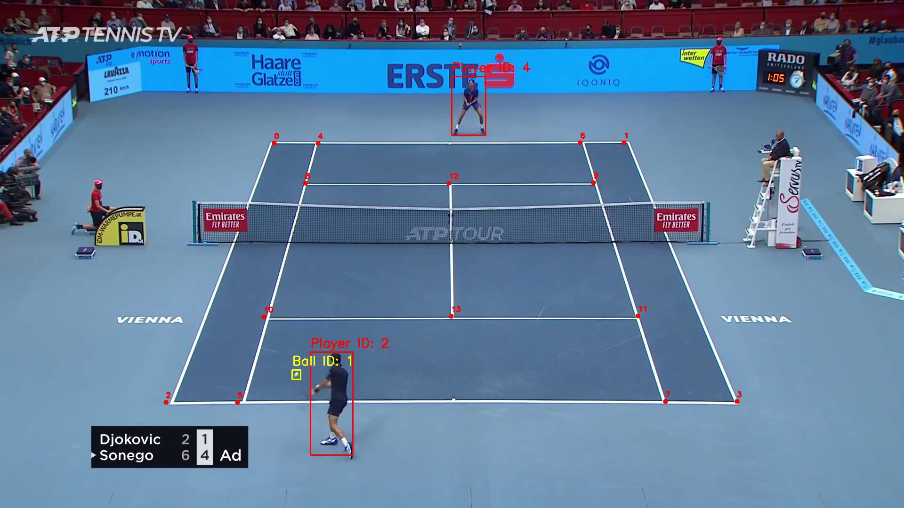

# Tennis Analysis

## Introduction
 In this project, we will build a Tennis Analysis System to detect and track players and the tennis ball. For player detection, we will use a pre-trained YOLOv12 model, while for tennis ball detection, we will fine-tune the YOLOv5 model on a tennis ball dataset from Roboflow. Additionally, we will detect tennis court keypoints by fine-tuning a ResNet50 model on the tennis court keypoints dataset.
To enhance the system, we will implement a player selection and filtering mechanism. Using the detected tennis court keypoints, we will detect the two players closest to the court.

## Output Videos
Here is a screenshot from one of the output videos:

## Models Used
* YOLOv12 for player detection and tracking
* Fine-Tuned YOLOv5 for tennis ball detection
* Fine-Tuned ResNet-50 to detect tennis court keypoints

* Trained YOLOV5 model for Tennis Ball Detection: https://drive.google.com/file/d/1YGcN5Nmqsg0j0LN1p-I0dcH1ZCXNa2cs/view?usp=sharing
* Trained tennis court key point detection model: https://drive.google.com/file/d/107F8wEAQa3jhzDKADDmqMry00mLfQ2rt/view?usp=sharing
## Training
* Tennis ball detetcor with YOLOv5: notebooks/tennis_ball_detector_training_yolov5.ipynb
* Tennis court keypoints detection: notebooks/tennis_courts_keypoints_detector_50.ipynb

## Requirements
* python3.11
* ultralytics
* pytroch
* numpy 
* opencv

